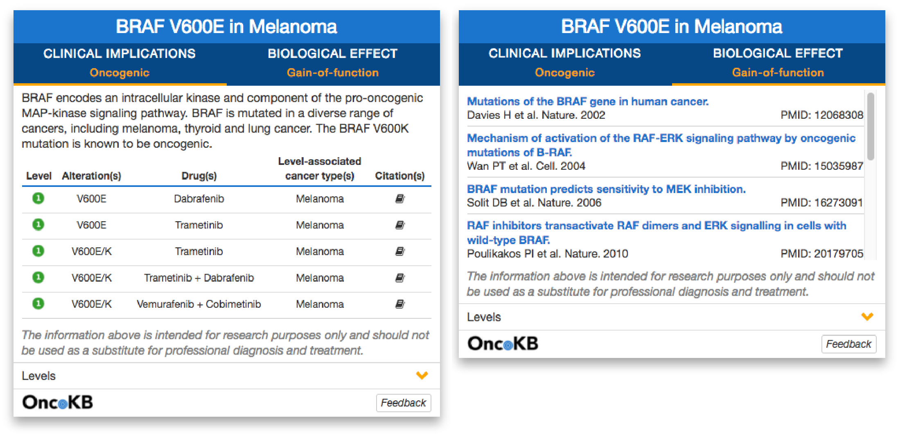

# OncoKB Card

OncoKB Card is a nice way to present OncoKB annotation.
We have integrated information from OncoKB into the cBioPortal for Cancer Genomics by using OncoKB card. When exploring variants in cbioportal.org, you will see annotations from OncoKB when available. [Example of a lung cancer case](http://www.cbioportal.org/case.do?cancer_study_id=luad_tcga_pub&sample_id=TCGA-49-4494-01).

Here is a screenshot for BRAF V600E Melanoma




Please use following commands to start the project.
```
npm install
bower install
grunt serve
```

License
--------------------

OncoKB free software: you can redistribute it and/or modify it under the terms of the GNU Affero General Public License, version 3, as published by the Free Software Foundation.

This program is distributed in the hope that it will be useful, but WITHOUT ANY WARRANTY; without even the implied warranty of MERCHANTABILITY or FITNESS FOR A PARTICULAR PURPOSE. See the GNU Affero General Public License for more details.

A public instance of OncoKB (http://oncokb.org) is hosted and maintained by Memorial Sloan Kettering Cancer Center. It provides access to all curators in MSKCC knowledgebase team.

If you are interested in coordinating the development of new features, please contact team@oncokb.org.
